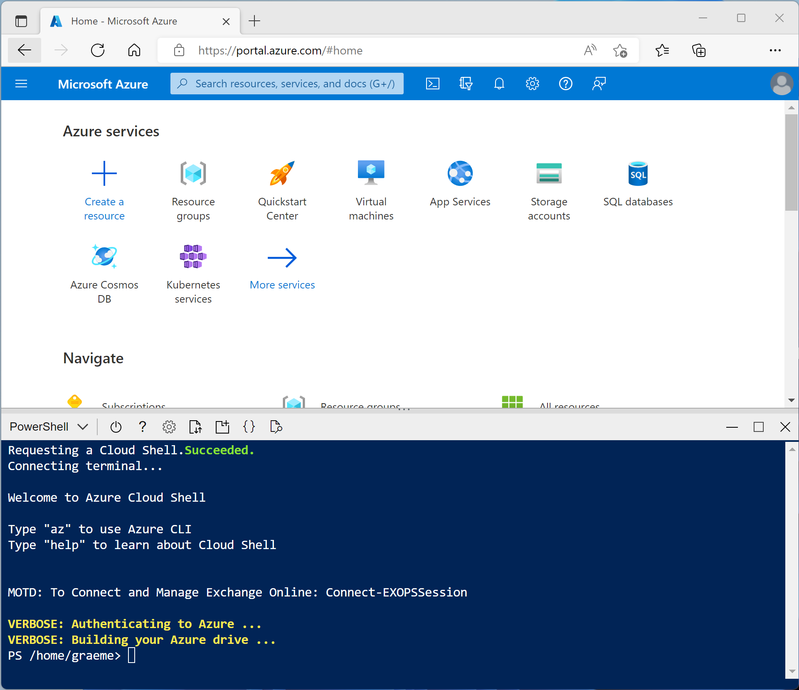

---
lab:
    title: 'Query a relational data warehouse'
    module: 'Implement a data warehouse in Azure Synapse Analytics'
---

# Query a relational data warehouse

Azure Synapse Analytics is built on a scalable set capabilities to support modern data warehousing; including file-based data analytics in a data lake as well as large-scale relational data warehouses and the data transfer and transformation pipelines used to load them. In this lab, you'll explore how to use a dedicated SQL pool in Azure Synapse Analytics to store and query data in a relational data warehouse.

This lab will take approximately **30** minutes to complete.

## Before you start

You'll need an [Azure subscription](https://azure.microsoft.com/free) in which you have administrative-level access.

## Provision an Azure Synapse Analytics workspace

An Azure Synapse Analytics *workspace* provides a central point for managing data and data processing runtimes. You can provision a workspace using the interactive interface in the Azure portal, or you can deploy a workspace and resources within it by using a script or template. In most production scenarios, it's best to automate provisioning with scripts and templates so that you can incorporate resource deployment into a repeatable development and operations (*DevOps*) process.

In this exercise, you'll use a combination of a PowerShell script and an ARM template to provision Azure Synapse Analytics.

1. Sign into the [Azure portal](https://portal.azure.com).
2. Use the **[\>_]** button to the right of the search bar at the top of the page to create a new Cloud Shell in the Azure portal, selecting a ***PowerShell*** environment and creating storage if prompted. The cloud shell provides a command line interface in a pane at the bottom of the Azure portal, as shown here:

    

    > **Note**: If you have previously created a cloud shell that uses a *Bash* environment, use the the drop-down menu at the top left of the cloud shell pane to change it to ***PowerShell***.

3. Note that you can resize the cloud shell by dragging the separator bar at the top of the pane, or by using the **&#8212;**, **&#9723;**, and **X** icons at the top right of the pane to minimize, maximize, and close the pane. For more information about using the Azure Cloud Shell, see the [Azure Cloud Shell documentation](https://docs.microsoft.com/azure/cloud-shell/overview).

4. In the PowerShell pane, enter the following commands to clone this repo:

    ```
    rm -r dp-000 -f
    git clone https://github.com/MicrosoftLearning/mslearn-synapse dp-000
    ```

5. After the repo has been cloned, enter the following commands to change to the folder for this lab and run the **setup.ps1** script it contains:

    ```
    cd dp-000/Allfiles/Labs/07
    ./setup.ps1
    ```

6. If prompted, choose which subscription you want to use (this will only happen if you have access to multiple Azure subscriptions).
7. When prompted, enter a suitable password to be set for your Azure Synapse SQL pool.

    > **Note**: Be sure to remember this password!

8. Wait for the script to complete - this typically takes around 15 minutes, but in some cases may take longer. While you are waiting, review the [What is dedicated SQL pool in Azure Synapse Analytics?](https://docs.microsoft.com/azure/synapse-analytics/sql-data-warehouse/sql-data-warehouse-overview-what-is) article in the Azure Synapse Analytics documentation.

## Explore the data warehouse schema

In this lab, the data warehouse is hosted in a dedicated SQL pool in Azure Synapse Analytics.

### Start the dedicated SQL pool

1. After the script has completed, in the Azure portal, go to the **dp000-*xxxxxxx*** resource group that it created, and select your Synapse workspace.
2. In the **Overview** page for your Synapse workspace, in the **Open Synapse Studio** card, select **Open** to open Synapse Studio in a new browser tab; signing in if prompted.
3. On the left side of Synapse Studio, use the **&rsaquo;&rsaquo;** icon to expand the menu - this reveals the different pages within Synapse Studio that are used to manage resources and perform data analytics tasks.
4. On the **Manage** page, ensure the **SQL pools** tab is selected and then select the **sql*xxxxxxx*** dedicated SQL pool and use its **&#9655;** icon to start it; confirming that you want to resume it when prompted.
5. Wait for the SQL pool to resume. This can take a few minutes. Use the **&#8635; Refresh** button to check its status periodically. The status will show as **Online** when it is ready.

### View the tables in the database

1. In Synapse Studio, select the **Data** page and ensure that the **Workspace** tab is selected and contains a **SQL database** category.
2. Expand **SQL database**, the **sql*xxxxxxx*** pool, and its **Tables** folder to see the tables in the database.

    A relational data warehouse is typically based on a schema that consists of *fact* and *dimension* tables. The tables are optimized for analytical queries in which numeric metrics in the fact tables are aggregated by attributes of the entities represented by the dimension tables - for example, enabling you to aggregate Internet sales revenue by product, customer, date, and so on.
    
3. Expand the **dbo.FactInternetSales** table and its **Columns** folder to see the columns in this table. Note that many of the columns are *keys* that reference rows in the dimension tables. Others are numeric values (*measures*) for analysis.
    
    The keys are used to relate a fact table to one or more dimension tables, often ina *star* schema; in which the fact table is directly related to each dimension table (forming a multi-pointed "star" with the fact table at the center).

4. View the columns for the **dbo.DimPromotion** table, and note that it has a unique **PromotionKey** that uniquely identifies each row in the table. It also has an **AlternateKey**.

    Usually, data in a data warehouse has been imported from one or more transactional sources. The *alternate* key reflects the business identifier for the instance of this entity in the source, but a unique numeric *surrogate* key is usually generated to uniquely identify each row in the data warehouse dimension table. One of the benefits of this approach is that it enables the data warehouse to contain multiple instances of the same entity at different points in time (for example, records for the same customer reflecting their address at the time an order was placed).

5. View the columns for the **dbo.DimProduct**, and note that it contains a **ProductSubcategoryKey** column, which references the **dbo.DimProductSubcategory** table, which in turn contains a **ProductCategoryKey** column that references the  **dbo.DimProductCategory** table.

    In some cases, dimensions are partially normalized into multiple related tables to allow for different levels of granularity - such as products that can be grouped into subcategories and categories. This results in a simple star being extended to a *snowflake* schema, in which the central fact table is related to a dimension table, which is turn related to further dimension tables.

6. View the columns for the **dbo.DimDate** table, and note that it contains multiple columns that reflect different temporal attributes of a date - including the day of week, day of month, month, year, day name, month name, and so on.

    Time dimensions in a data warehouse are usually implemented as a dimension table containing a row for each of the smallest temporal units of granularity (often called the *grain* of the dimension) by which you want to aggregate the measures in the fact tables. In this case, the lowest grain at which measures can be aggregated is an individual date, and the table contains a row for each date from the first to the last date referenced in the data. The attributes in the **DimDate** table enable analysts to aggregate measures based on any date key in the fact table, using a consistent set of temporal attributes (for example, viewing orders by month based on the order date). The **FactInternetSales** table contains three keys that relate to the **DimDate** table: **OrderDateKey**, **DueDateKey**, and **ShipDateKey**.

## Query the data warehouse tables

Now that you have explored some of the more important aspects of the data warehouse schema, you're ready to to query the tables and retrieve some data.

### Analyze Internet sales

1. On the **Data** page, select the **sql*xxxxxxx*** SQL pool and in its **...** menu, select **New SQL script** > **Empty script**.
2. When a new **SQL Script 1** tab opens, in its **Properties** pane, change the name of the script to **Analyze Internet Sales** and change the **Result settings per query** to return all rows. Then use the **Publish** button on the toolbar to save the script, and use the **Properties** button (which looks similar to **&#128463;.**) on the right end of the toolbar to close the **Properties** pane so you can see the script pane.
3. In the empty script, add the following code:

    ```sql
    SELECT  d.CalendarYear AS Year,
            SUM(i.SalesAmount) AS InternetSalesAmount
    FROM FactInternetSales AS i
    JOIN DimDate AS d ON i.OrderDateKey = d.DateKey
    GROUP BY d.CalendarYear
    ORDER BY Year;
    ```

4. Use the **&#9655; Run** button to run the script, and review the results, which should show the Internet sales totals for each year. This query joins the fact table for Internet sales to a time dimension table based on the order date, and aggregates the sales amount measure in the fact table by the calendar month attribute of the dimension table.

5. Modify the query as follows to add the month attribute from the time dimension, and then run the modified query.

    ```sql
    SELECT  d.CalendarYear AS Year,
            d.MonthNumberOfYear AS Month,
            SUM(i.SalesAmount) AS InternetSalesAmount
    FROM FactInternetSales AS i
    JOIN DimDate AS d ON i.OrderDateKey = d.DateKey
    GROUP BY d.CalendarYear, d.MonthNumberOfYear
    ORDER BY Year, Month;
    ```

    Note that the attributes in the time dimension enable you to aggregate the measures in the fact table at multiple hierarchical levels - in this case, year and month. This is a common pattern in data warehouses.

6. Modify the query as follows to remove the month and add a second dimension to the aggregation, and then run it to view the results (which show yearly Internet sales totals for each region):

    ```sql
    SELECT  d.CalendarYear AS Year,
            g.EnglishCountryRegionName AS Region,
            SUM(i.SalesAmount) AS InternetSalesAmount
    FROM FactInternetSales AS i
    JOIN DimDate AS d ON i.OrderDateKey = d.DateKey
    JOIN DimCustomer AS c ON i.CustomerKey = c.CustomerKey
    JOIN DimGeography AS g ON c.GeographyKey = g.GeographyKey
    GROUP BY d.CalendarYear, g.EnglishCountryRegionName
    ORDER BY Year, Region;
    ```

    Note that geography is a *snowflake* dimension that is related to the Internet sales fact table through the customer dimension. You therefore need two joins in the query to aggregate Internet sales by geography.

7. Modify and re-run the query to add another snowflake dimension and aggregate the yearly regional sales by product category:

    ```sql
    SELECT  d.CalendarYear AS Year,
            pc.EnglishProductCategoryName AS ProductCategory,
            g.EnglishCountryRegionName AS Region,
            SUM(i.SalesAmount) AS InternetSalesAmount
    FROM FactInternetSales AS i
    JOIN DimDate AS d ON i.OrderDateKey = d.DateKey
    JOIN DimCustomer AS c ON i.CustomerKey = c.CustomerKey
    JOIN DimGeography AS g ON c.GeographyKey = g.GeographyKey
    JOIN DimProduct AS p ON i.ProductKey = p.ProductKey
    JOIN DimProductSubcategory AS ps ON p.ProductSubcategoryKey = ps.ProductSubcategoryKey
    JOIN DimProductCategory AS pc ON ps.ProductCategoryKey = pc.ProductCategoryKey
    GROUP BY d.CalendarYear, pc.EnglishProductCategoryName, g.EnglishCountryRegionName
    ORDER BY Year, ProductCategory, Region;
    ```

    This time, the snowflake dimension for product category requires three joins to reflect the hierarchical relationship between products, subcategories, and categories.

8. Publish the script to save it.

### Analyze reseller sales

1. Create a new empty script for the **sql*xxxxxxx*** SQL pool, and save it with the name **Analyze Reseller Sales**.
2. Create SQL queries in the script to find the following information based on the **FactResellerSales** fact table and the dimension tables to which it is related:
    - The total quantity of items sold per fiscal year and quarter.
    - The total quantity of items sold per fiscal year, quarter, and sales territory region associated with the employee who made the sale.
    - The total quantity of items sold per fiscal year, quarter, and sales territory region by product category.

    > **Tip**: Compare your queries to the ones in the **Solution** script in the **Develop** page in Synapse Studio.

3. Experiment with queries to explore the rest of the tables in the data warehouse schema as your leisure.
4. When your done, on the **Manage** page, pause the **sql*xxxxxxx*** dedicated SQL pool.

## Delete Azure resources

If you've finished exploring Azure Synapse Analytics, you should delete the resources you've created to avoid unnecessary Azure costs.

1. Close the Synapse Studio browser tab and return to the Azure portal.
2. On the Azure portal, on the **Home** page, select **Resource groups**.
3. Select the **dp000-*xxxxxxx*** resource group for your Synapse Analytics workspace (not the managed resource group), and verify that it contains the Synapse workspace, storage account, and dedicated SQL pool for your workspace.
4. At the top of the **Overview** page for your resource group, select **Delete resource group**.
5. Enter the **dp000-*xxxxxxx*** resource group name to confirm you want to delete it, and select **Delete**.

    After a few minutes, your Azure Synapse workspace resource group and the managed workspace resource group associated with it will be deleted.
